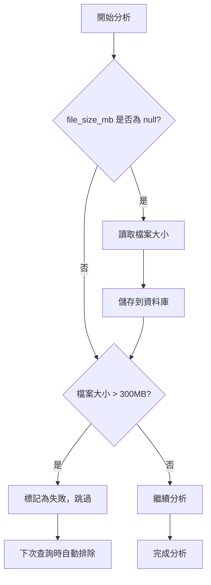

# 檔案大小優化機制

## 概述

為了避免重複檢查超過 Gemini API 限制（300MB）的影片檔案，我們在資料庫中新增了 `file_size_mb` 欄位，並在查詢時就直接過濾掉過大的檔案。

## 資料庫變更

### 新增欄位

在 `videos` 表中新增：
- **欄位名稱**：`file_size_mb`
- **類型**：`DECIMAL(10, 2)`
- **可為空**：是
- **說明**：影片檔案大小（MB）

### Migration

```bash
php artisan migrate
```

執行的 migration：`2025_12_17_120000_add_file_size_mb_to_videos_table.php`

## 運作機制

### 1. 檔案大小記錄

#### AnalyzeDocumentCommand（文檔分析）
- 在建立新的影片記錄時，嘗試取得 MP4 檔案大小
- 如果檔案存在且可讀取，儲存檔案大小到 `file_size_mb`
- 如果無法取得，設為 `null`（不影響記錄建立）

#### AnalyzeVideoCommand（影片分析）
- 在首次檢查影片檔案時，如果 `file_size_mb` 為 `null`，儲存檔案大小
- 確保每個影片記錄最終都會有檔案大小資訊

### 2. 查詢過濾

在 `VideoRepository::getIncompleteVideos()` 中：

```php
// 排除檔案過大的影片（超過 Gemini API 限制 300MB）
// 如果 file_size_mb 為 null，表示尚未檢查過，仍然包含在結果中
$query->where(function ($q) {
    $q->whereNull('file_size_mb')
      ->orWhere('file_size_mb', '<=', 300);
});
```

**邏輯說明**：
- `file_size_mb IS NULL`：尚未檢查過的影片，包含在查詢結果中
- `file_size_mb <= 300`：符合大小限制的影片，包含在查詢結果中
- `file_size_mb > 300`：超過限制的影片，**自動排除**

### 3. 處理流程



## 優勢

### 效能改善

| 項目 | 改善前 | 改善後 |
|-----|-------|-------|
| 查詢效率 | 需要 JOIN analysis_results 檢查錯誤訊息 | 直接在 videos 表過濾 |
| 檔案檢查 | 每次都要讀取檔案大小 | 只在首次檢查時讀取 |
| 重複處理 | 過大檔案每次都會被選取並檢查 | 過大檔案自動排除，不再處理 |

### 資源節省

假設有 100 個超過 300MB 的影片：

**改善前**：
- 每次執行 `analyze:video` 都會：
  1. 從資料庫查詢出這些影片
  2. 讀取每個檔案的大小（I/O 操作）
  3. 判斷過大後跳過
  4. 重複上述步驟

**改善後**：
- 首次執行時記錄檔案大小
- 之後的查詢直接在 SQL 層級排除
- **節省 100 次檔案 I/O 操作**

## 相容性

### 現有資料

對於已存在的影片記錄：
- `file_size_mb` 欄位為 `null`
- 首次執行 `analyze:video` 時會自動補上檔案大小
- 不需要手動更新現有資料

### 向後相容

- 不影響現有的分析流程
- 不影響 Dashboard 顯示
- 不影響匯出功能

## 使用方式

### 執行分析

```bash
# 分析所有來源的影片（自動跳過過大檔案）
php artisan analyze:video

# 分析特定來源
php artisan analyze:video --source=CNN --storage=gcs --limit=50
```

### 查詢統計

```sql
-- 查看檔案大小分布
SELECT 
    CASE 
        WHEN file_size_mb IS NULL THEN '未檢查'
        WHEN file_size_mb <= 100 THEN '0-100MB'
        WHEN file_size_mb <= 200 THEN '100-200MB'
        WHEN file_size_mb <= 300 THEN '200-300MB'
        ELSE '超過300MB'
    END AS size_range,
    COUNT(*) as count
FROM videos
GROUP BY size_range
ORDER BY size_range;

-- 查看超過限制的影片
SELECT 
    source_name,
    source_id,
    file_size_mb,
    nas_path
FROM videos
WHERE file_size_mb > 300
ORDER BY file_size_mb DESC;
```

## 錯誤處理

### JSON 解析失敗

**錯誤訊息**：「清理後的字串不是有效的 JSON (影片分析)」

**處理方式**：
- 狀態標記為 `VIDEO_ANALYSIS_FAILED`
- 下次執行時會自動重試
- ✅ **合理**：可能是 API 臨時錯誤

### 檔案過大

**錯誤訊息**：「影片檔案過大 (XXX MB)，超過 Gemini API 限制 (300MB)」

**處理方式**：
- 狀態標記為 `VIDEO_ANALYSIS_FAILED`
- `file_size_mb` 記錄實際大小
- 下次查詢時自動排除
- ✅ **優化**：不會重複檢查

## 維護建議

### 定期清理

如果儲存空間有限，可以定期清理超過限制的影片記錄：

```sql
-- 查看可清理的記錄數量
SELECT COUNT(*) 
FROM videos 
WHERE file_size_mb > 300 
AND analysis_status = 'video_analysis_failed';

-- 清理超過限制且失敗的記錄（謹慎使用）
-- DELETE FROM videos 
-- WHERE file_size_mb > 300 
-- AND analysis_status = 'video_analysis_failed';
```

### 監控建議

建議定期監控：
1. 超過限制的影片數量
2. `file_size_mb` 為 `null` 的記錄數量
3. 平均檔案大小趨勢

## 相關檔案

- Migration: `database/migrations/2025_12_17_120000_add_file_size_mb_to_videos_table.php`
- Model: `app/Models/Video.php`
- Repository: `app/Repositories/VideoRepository.php`
- Command: `app/Console/Commands/AnalyzeVideoCommand.php`
- Command: `app/Console/Commands/AnalyzeDocumentCommand.php`

## Dashboard 顯示優化

### 檔案大小顯示

在 Dashboard 中會顯示影片檔案大小資訊：

**影片資訊區塊**：
- 顯示檔案大小（例如：156.34 MB）
- 如果超過 300MB，會顯示橘色警告標籤「超過限制」

### 分析狀態提示

**評分資訊區塊**：
- 一般情況：顯示「（影片內容尚未分析，無評分資訊）」
- 檔案過大：顯示「⚠️ 影片檔案超過大小限制無法分析（XXX MB > 300 MB）」
  - 使用橘色背景
  - 左側有橘色邊框
  - 更醒目的警告樣式

### 視覺呈現

```
┌─────────────────────────────────────────┐
│ 評分資訊                                │
├─────────────────────────────────────────┤
│ ⚠️ 影片檔案超過大小限制無法分析       │
│    (456.78 MB > 300 MB)                 │
│ [橘色背景，左側橘色邊框]               │
└─────────────────────────────────────────┘

┌─────────────────────────────────────────┐
│ 影片資訊                                │
├─────────────────────────────────────────┤
│ 💾 檔案大小: 456.78 MB [超過限制]     │
│ [檔案大小以橘色顯示，附帶警告標籤]     │
└─────────────────────────────────────────┘
```

## 版本歷史

- **2025-12-17**: 初始版本，新增檔案大小優化機制
- **2025-12-17**: 新增 Dashboard 顯示優化，明確標示檔案過大的影片

